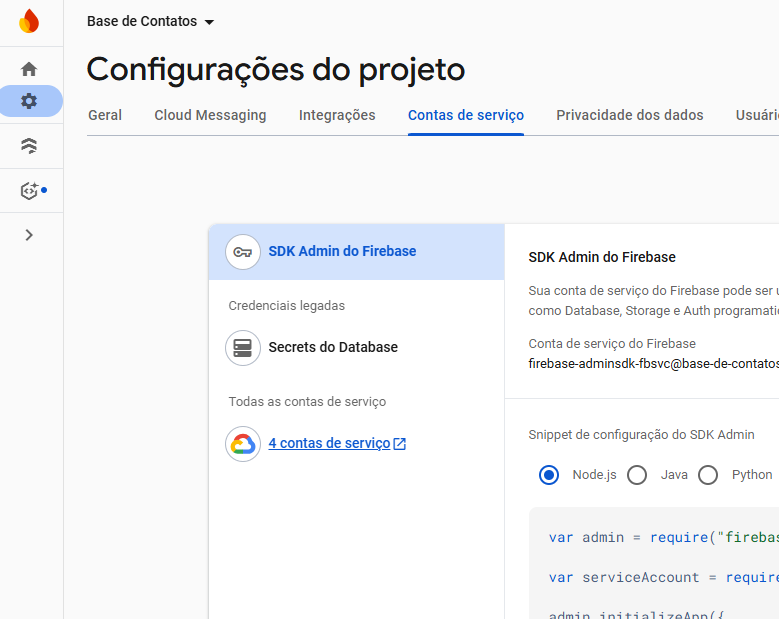
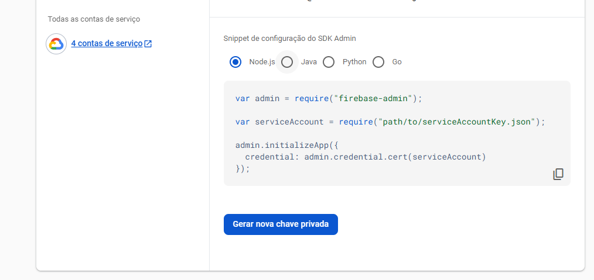

# 🗺️ PacContacts: Extrator de Contatos do Google Maps

Este projeto é uma ferramenta de web scraping desenvolvida em Python que utiliza o **Playwright** para automatizar a busca por estabelecimentos no Google Maps com base em um segmento e localização definidos. Os dados extraídos são armazenados localmente em JSON/CSV e persistidos no **Google Firestore (Firebase)**. A interface de busca e controle é provida por um servidor **Flask** simples.

-----

## 🚀 Funcionalidades Principais

  * **Extração de Dados:** Coleta nome, endereço, telefone e segmento de estabelecimentos.
  * **Busca em Lote:** Permite configurar buscas para múltiplos locais com um único segmento.
  * **Persistência de Dados:** Salva os contatos em um arquivo local (`contacts.json`) e no Firestore.
  * **Interface Web (Flask):** Frontend simples para configurar buscas e visualizar/exportar resultados.
  * **Exportação CSV:** Permite baixar os dados extraídos em formato CSV.

-----

## ⚙️ Estrutura do Projeto

O projeto segue uma estrutura modular, separando a lógica de scraping, a lógica de utilitários (Firebase) e a interface web (Flask).

```
.
├── configs/
│   └── firebaseConfig.json   # Credenciais do Firebase
├── inputs/
│   └── search_list.json      # Arquivo de entrada lido pelo scraper
├── output/
│   ├── contacts.json         # Dados extraídos (backup local)
│   └── contacts.csv          # Saída da exportação (gerado pelo Flask)
├── src/
│   ├── main.py               # Ponto de entrada CLI (inicia Playwright)
│   ├── scraper.py            # Contém a lógica de automação e raspagem (Playwright)
│   └── utils/
│       ├── __init__.py
│       └── firebase_utils.py # Funções para conexão e gravação no Firestore
├── web/
│   ├── app.py                # Servidor Flask (API e Roteamento)
│   ├── __init__.py           # Marca 'web' como pacote Python
│   ├── static/               # Arquivos JS, CSS e Imagens do Frontend
│   └── templates/
│       └── index.html        # Frontend da aplicação
├── venv/                     # Ambiente virtual
└── README.md
```

-----

## Pré-requisitos

Para rodar este projeto, você precisará ter instalado:

  * **Python 3.8+**
  * **Node.js/npm** (necessário para o Playwright baixar os binários dos navegadores)
  * **Conta Firebase/Google Cloud** para configurar as credenciais do Firestore.

-----

## 💡 Entendendo a Estrutura do Firebase

Antes de configurar o projeto, este vídeo do canal oficial do Firebase explica a estrutura e o relacionamento entre projetos e aplicativos, fundamental para a correta configuração do Firestore:

**Título:** How Firebase projects and apps work
**Canal:** Firebase
**Data de Publicação:** 24 de junho de 2022
**Duração:** 13 minutos e 57 segundos

[](https://www.youtube.com/watch?v=27BUpiAXt9M "Assista ao vídeo no YouTube")


O vídeo aborda:

  * **O que é um projeto Firebase:** O projeto é o contêiner principal para todos os serviços, gerenciamento de equipe e controle de faturamento, sendo um projeto do Google Cloud com serviços Firebase ativados [[02:37](http://www.youtube.com/watch?v=27BUpiAXt9M&t=157)].
  * **Projetos vs. Apps:** Todos os aplicativos registrados em um projeto devem ter o **mesmo caso de uso de negócio** e **compartilharão os mesmos recursos** (como banco de dados e usuários) [[03:33](http://www.youtube.com/watch=27BUpiAXt9M&t=213)].
  * **Regras de Ouro:** A Firebase recomenda a regra de **"um projeto Firebase por logo"** ao desenvolver apps para diferentes clientes/marcas [[07:37](http://www.youtube.com/watch=27BUpiAXt9M&t=457)].


**A. Acessar o Painel de Contas de Serviço**

Vá ao console do Google Cloud ou Firebase, encontre o seu projeto e acesse a seção de **Contas de Serviço** para gerenciar as chaves.



**B. Gerar e Salvar a Chave Privada**

1.  Crie uma nova chave (ou use a conta de serviço existente).
2.  Gere o arquivo no formato **JSON**.



3.  Crie a pasta `configs/` na raiz do seu projeto e salve este arquivo JSON como **`configs/firebaseConfig.json`**.

-----

## 📦 Configuração e Instalação

### 1\. Clonar o Repositório

```bash
git clone git@github.com:osmagal/PacContacts.git
cd PacContacts
```

### 2\. Configurar o Ambiente Virtual (Venv)

É crucial isolar as dependências do projeto:

```bash
# Criar o ambiente virtual
python -m venv venv

# Ativar o ambiente virtual
# Windows (PowerShell):
.\venv\Scripts\Activate.ps1
# Linux/macOS:
source venv/bin/activate
```

### 3\. Instalar Dependências Python

Com o `venv` ativado, instale as bibliotecas necessárias:

```bash
pip install -r requirements.txt
# Se necessário, instale individualmente:
# pip install playwright firebase-admin flask pandas
```

### 4\. Instalar Binários do Playwright

O Playwright precisa dos navegadores (Chromium, Firefox, WebKit) para funcionar:

```bash
playwright install
```

### 5\. Configurar o Firebase (Chave de Serviço)

Para que o script possa gravar dados no Firestore, você precisa de uma **chave de serviço (Service Account Key)** do Google.

**A. Acessar o Painel de Contas de Serviço**

Vá ao console do Google Cloud ou Firebase, encontre o seu projeto e acesse a seção de **Contas de Serviço** para gerenciar as chaves.

**B. Gerar e Salvar a Chave Privada**

1.  Crie uma nova chave (ou use a conta de serviço existente).
2.  Gere o arquivo no formato **JSON**.
3.  Crie a pasta `configs/` na raiz do seu projeto e salve este arquivo JSON como **`configs/firebaseConfig.json`**.

-----

## ▶️ Como Executar a Aplicação Web

Para garantir que todas as importações funcionem corretamente, o servidor Flask deve ser iniciado a partir da pasta raiz (`PacContacts/`).

### 1\. Configurar o Flask (Uma Vez por Sessão)

Defina a variável de ambiente `FLASK_APP` para apontar para a sua aplicação:

```bash
# Windows (PowerShell)
$env:FLASK_APP="web.app"
```

### 2\. Iniciar o Servidor

Inicie o servidor de desenvolvimento do Flask:

```bash
flask run
```

O servidor estará acessível em `http://127.0.0.1:5000/`.

### 3\. Usando o Frontend

1.  Acesse o endereço no seu navegador.
2.  Preencha o **Segmento** e adicione as **localizações**.
3.  Clique em **"BUSCAR CONTATOS"**.
4.  Após a conclusão, use **"Atualizar Tabela"** e **"Baixar CSV"** para acessar os resultados.

-----

## 💻 Execução Via Linha de Comando (CLI)

Se preferir rodar o scraper sem a interface web, certifique-se de que o arquivo `inputs/search_list.json` esteja configurado.

```bash
# Na pasta raiz do projeto, com o venv ativo:
python -m src.main
```

-----

## 🤝 Contribuição

Sinta-se à vontade para abrir *issues* ou *pull requests* para melhorias, como:

  * Implementação de filas assíncronas (Celery/RQ) para a raspagem.
  * Melhorias na estabilidade do Playwright (tratamento de Captchas/Erros).

-----

**Licença:** Este projeto é de uso livre.
